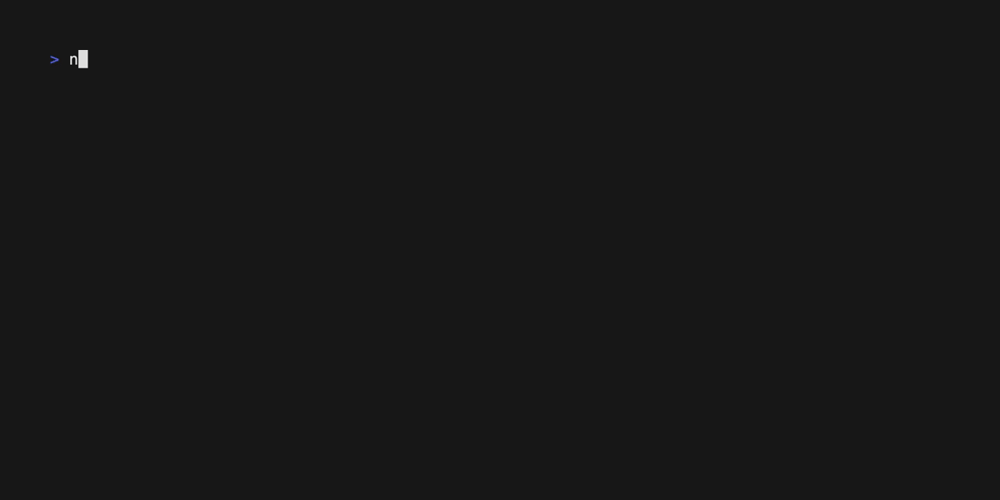

# Notes CLI

A simple, lightweight command-line notes manager written in Go.

## Features

- Create note
  

- View and manage notes
  

- Customizable storage location and editor

## Installation

```bash
go install github.com/ionut-t/notes@latest
```

## Usage

### Basic Commands

```bash
# Create a new note
notes add

# Launch the notes manager UI
notes

# Configure settings
notes config [flags]
```

### Configuration Options

```bash
# Open configuration file in your default editor
notes config

# Set custom editor
notes config --editor nvim

# Set custom storage location
notes config --storage ~/Documents/my-notes

# Show line numbers in markdown preview by default
notes config --v-line
```

## Configuration

Notes CLI stores its configuration in `~/.notes/.config.toml`. You can customize:

| Setting   | Description                                      | Default                        |
| --------- | ------------------------------------------------ | ------------------------------ |
| `editor`  | Text editor to use                               | Environment `$EDITOR` or `vim` |
| `storage` | Directory to store notes                         | `~/.notes`                     |
| `v_line`  | Show line numbers in markdown preview by default | `false`                        |

## Directory Structure

```
~/.notes/              # Default storage location
├── .config.toml       # Configuration file
└── *.md               # Your markdown notes
```

## License

[MIT License](LICENSE)

